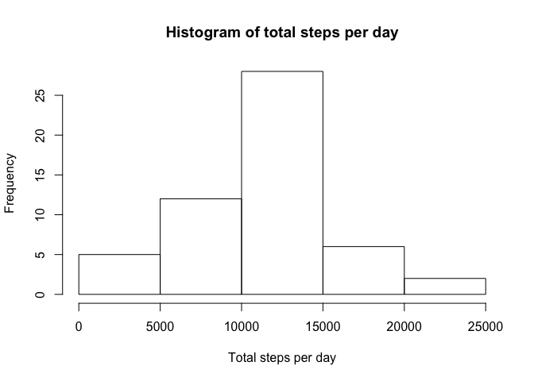
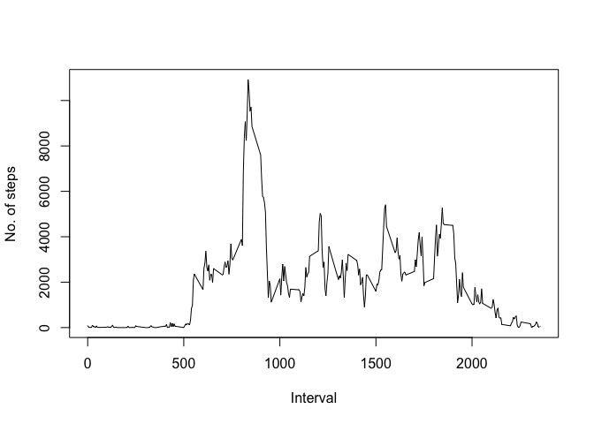
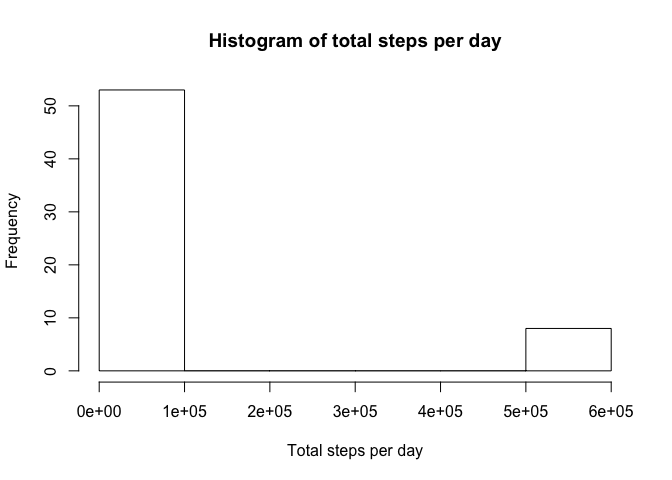
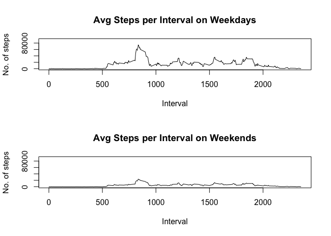

# Reproducible Research: Peer Assessment 1

## Introduction

This assignment is an answer to *Reproducible Research* course assignment 1, in which data from an activity monitoring device is being analysed to answer a number of questions, providing working code and plots as appropriate.

## Data
The data consists of a [provided activity data file] (https://d396qusza40orc.cloudfront.net/repdata%2Fdata%2Factivity.zip) on which all of the calculations performed in this assignment are done. A copy is present as the *activity.zip* file in the repository folder.

## Assignment

The discussion below follows the overall flow of the assignment, performing tasks, doing analyses, and answering various questions as posed by the assignment.

### Loading and processing the data

First up, we load and process the provided data, by unzipping the file containing our dataset and loading it into a dataframe for later manupulation and analysis. I have used the *rio* library (you may need to install this), to download and import the data in a single line, to ensure we use an up-to-date dataset, and that we don't need to mess around with creating temporary files, unzipping commands, etc. We should also cast *interval* and *steps* as numeric values, and *date* as a Date for easier processing later.


```r
library("rio")
library("timeDate")
movement.df <- import("https://d396qusza40orc.cloudfront.net/repdata%2Fdata%2Factivity.zip")
movement.df$steps <- as.numeric(movement.df$steps)
movement.df$interval <- as.numeric(movement.df$interval)
movement.df$date <- as.Date(movement.df$date)
```

### Mean total number of steps taken per day

First up, let's produce a quick histogram of the number of steps taken each day. We aggregate the total steps taken by day, and see what that looks like:


```r
totalStepsByDay <- aggregate(steps ~ date, FUN=sum, data = movement.df)
hist(totalStepsByDay$steps, xlab="Total steps per day", main="Histogram of total steps per day")
```

 

But what does that look like in more mathematical terms? We can get the mean by:


```r
mean(totalStepsByDay$steps, na.rm = TRUE)
```

```
## [1] 10766.19
```

And we can calculate the median by:


```r
median(totalStepsByDay$steps, na.rm = TRUE)
```

```
## [1] 10765
```

### Average Daily Activity Pattern

What does average daily activity look like? Let's first create a dataframe with the average daily steps for each day:


```r
avgStepsByInterval <- aggregate(steps ~ interval, FUN=sum, data= movement.df)

plot(avgStepsByInterval$interval, avgStepsByInterval$steps, type= "l", ylab="No. of steps", xlab="Interval")
```

 

There appears to be a high spike somewhere between interval 500 and 1000. Let's try and narrow down which interval, specifically, is giving us the largest number of average steps. First, let's find out which is the largest average number of steps:


```r
maxSteps <- format(max(avgStepsByInterval$steps), scientific=F)
```

Then, let's see which interval that step value belongs to:


```r
highestInterval <- avgStepsByInterval[avgStepsByInterval$steps == maxSteps,]
```

So we can see that the 5-minute interval no 835 has the highest average number of steps (10927 steps).

### Imputing Missing Values

First up, let's calculate the total number of rows with NAs:


```r
summary(movement.df)
```

```
##      steps             date               interval     
##  Min.   :  0.00   Min.   :2012-10-01   Min.   :   0.0  
##  1st Qu.:  0.00   1st Qu.:2012-10-16   1st Qu.: 588.8  
##  Median :  0.00   Median :2012-10-31   Median :1177.5  
##  Mean   : 37.38   Mean   :2012-10-31   Mean   :1177.5  
##  3rd Qu.: 12.00   3rd Qu.:2012-11-15   3rd Qu.:1766.2  
##  Max.   :806.00   Max.   :2012-11-30   Max.   :2355.0  
##  NA's   :2304
```

We can see that the dataframe has 2304 missing values. To deal with this as best we can, let's simply replace all NA's with the average for that 5-minute interval, taken from our earlier calculations. We will do this in a new dataset, so as not to overwrite our original data. Because I am no good at apply-wizardry, we will instead do a *JOIN* between the *movement.df* dataframe to bring in a column swith averages for each interval, and then replace any NA's with their corresponding average in the newly-merged column. 


```r
movementCleaned.df <- movement.df

movementCleaned.df <- merge(movementCleaned.df, avgStepsByInterval, by="interval")

the.nas <- is.na(movementCleaned.df$steps.x)
movementCleaned.df$steps.x[the.nas] <- movementCleaned.df$steps.y[the.nas]

movementCleaned.df <- data.frame(steps = movementCleaned.df$steps.x, interval = movementCleaned.df$interval, date = movementCleaned.df$date)
```

We now have a new dataset with all of the NAs imputed. Let's check quickly:


```r
summary(movementCleaned.df)
```

```
##      steps            interval           date           
##  Min.   :    0.0   Min.   :   0.0   Min.   :2012-10-01  
##  1st Qu.:    0.0   1st Qu.: 588.8   1st Qu.:2012-10-16  
##  Median :    0.0   Median :1177.5   Median :2012-10-31  
##  Mean   :  292.3   Mean   :1177.5   Mean   :2012-10-31  
##  3rd Qu.:   43.0   3rd Qu.:1766.2   3rd Qu.:2012-11-15  
##  Max.   :10927.0   Max.   :2355.0   Max.   :2012-11-30
```

And indeed, we have no more NAs left. Let's now compute the histogram of the total number of steps taken each day:


```r
totalStepsByDay <- aggregate(steps ~ date, FUN=sum, data = movementCleaned.df)
hist(totalStepsByDay$steps, xlab="Total steps per day", main="Histogram of total steps per day")
```

 

But what does that look like in more mathematical terms? We can get the mean by:


```r
mean(totalStepsByDay$steps, na.rm = TRUE)
```

```
## [1] 84188.07
```

And we can calculate the median by:


```r
median(totalStepsByDay$steps, na.rm = TRUE)
```

```
## [1] 11458
```

As we can see, imputing the value of the NAs produces a vastly different (and quite likely incorrect) distribution. In particular, the average number of steps from the most busy times (around interval 835), have been repeated over a number of days, producing ridiculously high overall totals for certain days.Interestingly, while our mean number of steps has been increased considerably, our median number of steps has not increased by as much.

### Differences in Patterns Between Weekdays and Weekends

First up, let's factor the data to get a new column *day* that can tell us what day of the week we are recording steps on:


```r
movementCleaned.df$isWeekday <- isWeekday(movementCleaned.df$date, wday=1:5)
```

Then, let's plot the average steps taken in each interval, for weekdays and weekends. That gives us the graph below.


```r
par(mfrow = c(2,1))

avgStepsByIntervalWeekdays <- aggregate(steps ~ interval, FUN=sum, data= movementCleaned.df[movementCleaned.df$isWeekday == TRUE,])
avgStepsByIntervalWeekends <- aggregate(steps ~ interval, FUN=sum, data= movementCleaned.df[movementCleaned.df$isWeekday == FALSE,])

plot(avgStepsByIntervalWeekdays$interval, avgStepsByIntervalWeekdays$steps, type= "l", ylab="No. of steps", xlab="Interval", main="Avg Steps per Interval on Weekdays", ylim=c(0,90000))
plot(avgStepsByIntervalWeekends$interval, avgStepsByIntervalWeekends$steps, type= "l", ylab="No. of steps", xlab="Interval", main="Avg Steps per Interval on Weekends", ylim=c(0,90000))
```

 

From this, we can see that the overall distributions are similar on weekdays vs weekends, but that the overall *number* of steps is greatly reduced. So while there is a difference in overall volume of average steps, the daily pattern of activity does not appear to vary all that much.
